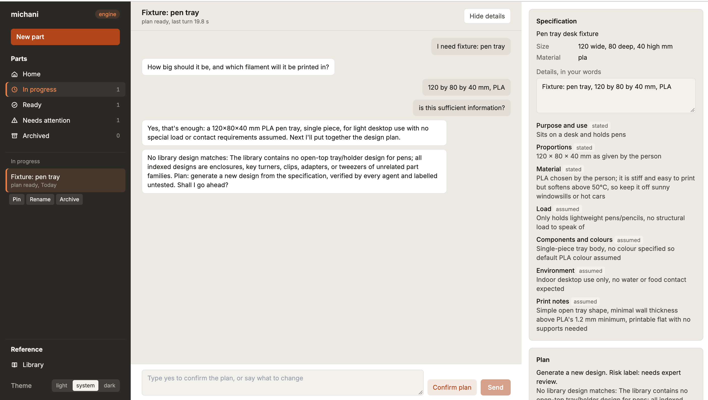
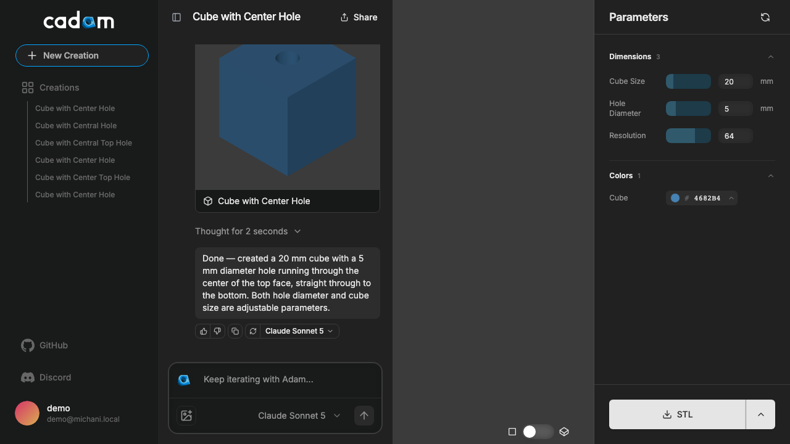
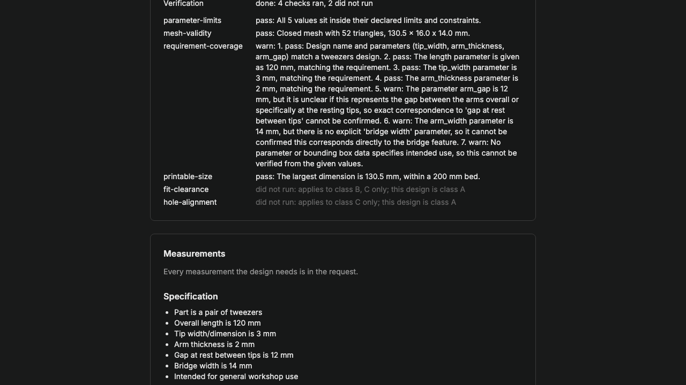
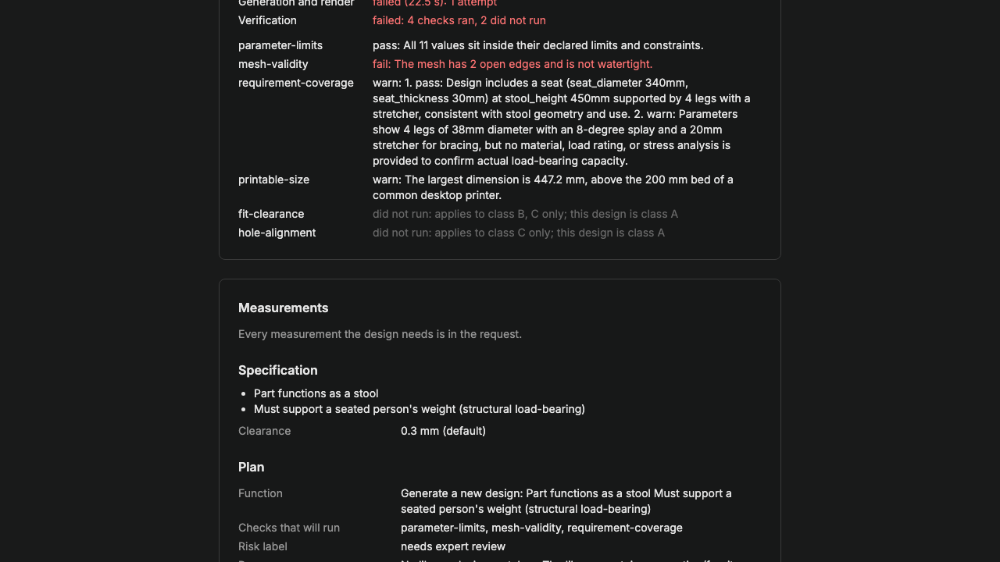

# Michani

Michani turns a conversation into a printable part. A person says what they need. Michani asks for size and material, proposes a plan, builds the part, and checks it. Output is an STL mesh, the OpenSCAD source with its values set, and a check report.

It serves people who have a printer and no design file. Field engineers on water and solar projects need a bracket or fitting that matches hardware already on site. People using a shared printer at a library, school, or makerspace need a tool at filament cost.

## Flow

Every part goes through three steps: requirements, build, verification. A state machine in `src/engine/session.ts` runs them in order. No agent can skip a state.

### 1. Requirements

A requirements agent turns the conversation into a specification. It records the part, its dimensions in millimetres, the material, any hardware it fits, the load, and the environment. Size and material are the two facts it asks for until it has them.

From that specification it writes a plan. A plan names a library design to adapt, or generation of new code when no design matches. It also names the risk label and the checks that will run. Nothing is built until the person confirms the plan.



### 2. Build

Adaptation sets declared parameters on a library design. It writes no geometry. Generation writes new OpenSCAD from the specification and plan.

Either path renders in the browser. Each declared parameter becomes a slider limited to its declared range. The mesh exports as STL, SCAD, or DXF.



### 3. Verification

Every build runs through the registered checks before it reaches the person. Each check returns pass, warn, fail, or did not run with a reason. The report quotes the evidence.

Here the tweezers pass parameter limits, mesh validity, and printable size. Requirement coverage warns where a parameter name does not map to a stated requirement.



A failed verdict returns to the build step with its finding, up to three times. This generated stool fails on two counts. Its mesh has open edges. Its largest dimension exceeds a 200 mm bed. Its plan carries the risk label "needs expert review" because a person sits on it.



## Library

Each design under `library/` is one OpenSCAD file and one JSON record. A record declares every adjustable value with a default, a minimum, and a maximum. It also states source, licence, attribution, part class, risk label, and evidence level. Evidence levels are untested, prototyped, field used, test data published, and clinically validated.

Adding a design means adding one folder. Five exist today: tweezers, a key turner, a pipe adapter, a panel mounting clip, and a two-part board enclosure. Shared components sit in `library/components`. Material properties sit in `library/materials.json`.

## Verification checks

Checks under `src/server/verification/checks` register against one interface. Six exist today: parameter limits, mesh validity, printable size, requirement coverage, fit clearance, and hole alignment. A new check is one file plus one registry line.

Verification agents in `src/engine/agents/verification.ts` group those checks into four verdicts: geometry, coverage, printability, and fit. A part for medical, drinking-water, or load-bearing use carries the risk label "needs expert review" in its plan and report.

## Implementation guidance

Four extension points cover most changes. Each one adds files and leaves the loop controller untouched.

### Adding a library design

1. Create `library/<id>/design.scad`. Declare every adjustable value as a top-level variable with a Customizer range comment, for example `length = 100; // [60:160]`. Put geometry in modules below the variables. The drafting agent overrides variables and never edits the body.
2. Create `library/<id>/design.json` beside it. Required fields: `id`, `name`, `description`, `file`, `source` (`curated`), `licence`, `attribution`, `partClass` (`A`, `B`, or `C`), `riskLabel`, `evidenceLevel`, and `parameters`. Each parameter carries `id`, `variable` (the OpenSCAD name), `attributeId` (from `library/attributes.json`), `default`, `min`, and `max`. Class B and C designs also list `interfaceFeatures` so fit clearance and hole alignment have something to measure.
3. Run `npm run test:unit -- loader`. The loader test parses every folder against `shared/schemas/library.ts` and fails on a missing field or a range that disagrees with the SCAD comment.
4. Start the app once. `src/server/library/index.ts` seeds the folder into the `designs` table on first use. Generated rows are never overwritten.

### Adding a check

1. Create one file under `src/server/verification/checks/`. Export a `CheckDefinition` with `id`, `name`, `partClasses`, and `inputs` (any of `parameters`, `design`, `specification`, `mesh`, `buildVolume`). Export a `CheckImplementation` that takes `CheckInputs` and returns `result`, `finding`, optional `suggestedRevision`, and `inputsUsed`. `printableSize.ts` is the shortest example.
2. Add one `registerCheck` call in `checks/index.ts`. The registry rejects a duplicate id.
3. Add a test under `tests/unit/checks/`. Cover pass, warn or fail, and the missing-input case. A check that calls the model takes `inputs.model` and runs in tests with a scripted answer, as `requirementCoverage.test.ts` does.
4. Do not touch `src/server/loop/`. `tests/unit/checks/printableSize.test.ts` greps that folder for its check id and fails if one appears. Copy that assertion for a new check.

### Adding a verification agent

1. Register a `VerificationAgent` in `src/engine/agents/verification.ts` with `id`, `name`, `partClasses`, `tools` (names from the tool registry), `budget` (step count), and `instructions`. Set `research: true` to grant the provider web search tool.
2. Its verdict schema is fixed: `result`, `finding`, optional `suggestedRevision`. The loop records every tool call as evidence.
3. Add a replay test under `tests/unit/engine/` beside `verification-agents.test.ts`, with a scripted model. Run the live version with `LIVE_AGENT_TESTS=1`.

### Adding a tool

1. Call `registerTool` in `src/engine/tools/` with `name`, `description`, a zod `input` schema, and `run`. Inputs are parsed before `run` executes, which keeps model output away from the file system, the renderer, and the shell.
2. Grant it to an agent by name in that agent's `tools` list. An agent sees only the tools it is granted.
3. Test through `callTool(name, input)` so the schema runs in the test too.

### Committing a change

Work is one GitHub issue per commit, committed to `main` and pushed at once. Run the fast suite first. Write the subject in Conventional Commits form and end the body with `closes #N`. Keep the diff to its ticket. File a neighbouring bug rather than folding it in.

## Running it

Requirements: Node.js 20.19 or 22.12 and newer, npm 10, Docker Desktop, the Supabase CLI, and an Anthropic API key. Every agent step calls Anthropic. One key covers the application.

```bash
git clone https://github.com/reversely/michani.git
cd michani
npm install
uv sync                                 # pre-commit tooling
supabase start -x logflare,vector       # local database and auth
cp .env.local.template .env.local       # Supabase URL and keys from `supabase status`, plus ANTHROPIC_API_KEY
npm run dev                             # http://localhost:3000/cadam/engine
```

Other provider keys in the template stay as placeholders.

## Tests

```bash
npm run typecheck && npm run lint && npm run test:unit     # fast suite, recorded model answers
npm run test:e2e                                           # Playwright, needs Supabase and the dev server
LIVE_AGENT_TESTS=1 npm run test:unit -- agents             # calls Anthropic
```

A pre-commit hook runs file hygiene, the type check, and lint-staged.

## Layout

| Path                       | Contents                                                                         |
| -------------------------- | -------------------------------------------------------------------------------- |
| `src/engine`               | Session state machine, loop, requirements and verification agents, tool registry |
| `src/server/agents`        | Library, drafting, and generation prompts and output schemas                     |
| `src/server/verification`  | Check registry and the checks                                                    |
| `src/server/report`        | Check report and package builder                                                 |
| `src/views/EngineView.tsx` | Workspace and conversation screen                                                |
| `library/`                 | Designs and their metadata records                                               |
| `shared/schemas`           | Zod schemas for designs, specifications, plans, and check results                |
| `tests/`                   | Unit, render, and end-to-end suites with recorded fixtures                       |
| `supabase/`                | Migrations and local stack configuration                                         |

## CAD

OpenSCAD is the only CAD language. Library files declare adjustable values as top-level variables with Customizer range comments. A drafting agent passes values as variable overrides and never edits a file body. Rendering runs in the browser through an OpenSCAD WebAssembly build. BOSL, BOSL2, MCAD, and NopSCADlib ship with it.

That renderer, the parameter sliders, the export path, and the Supabase-backed application shell come from [CADAM](https://github.com/Adam-CAD/CADAM) by AdamCAD. This repository forks it. Michani is distributed under the GNU General Public License v3.0. See `LICENSE`. CADAM and the portions of openscad-web-gui it derives from carry the same licence. Bundled OpenSCAD WASM binaries are GPL v2 or later, distributed here under GPLv3 as part of the combined work. See `src/vendor/openscad-wasm/SOURCE-OFFER.txt`. Each library design records its own licence and attribution in its metadata, and the package copies them into the download.
