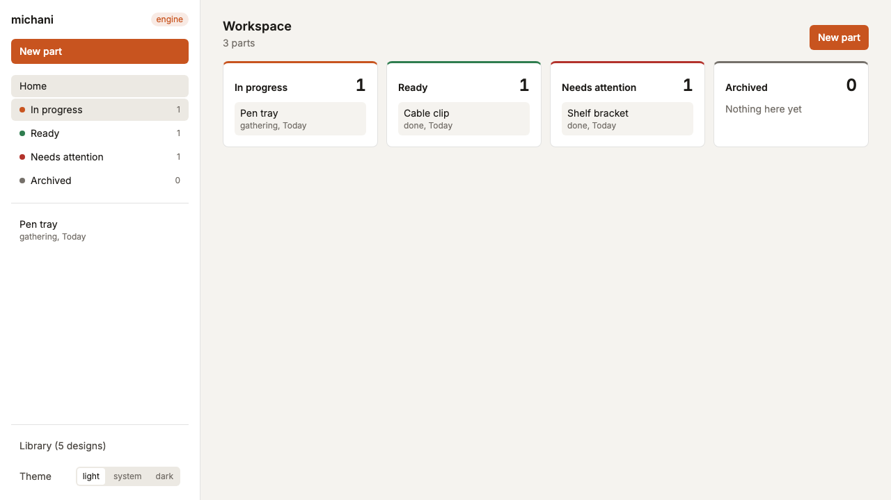
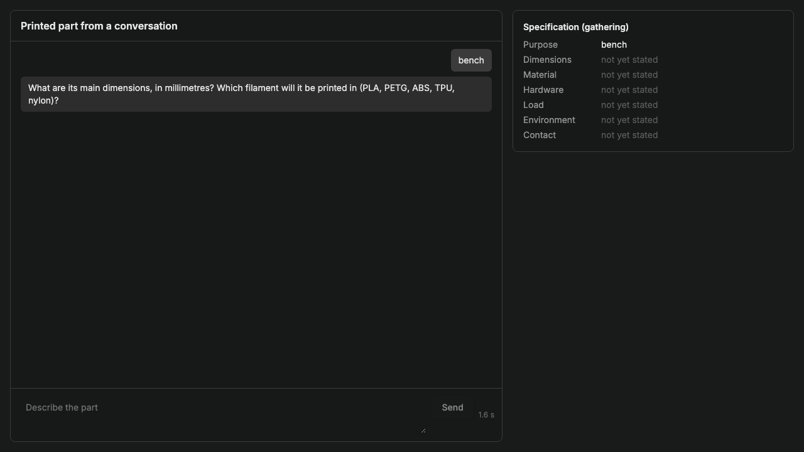
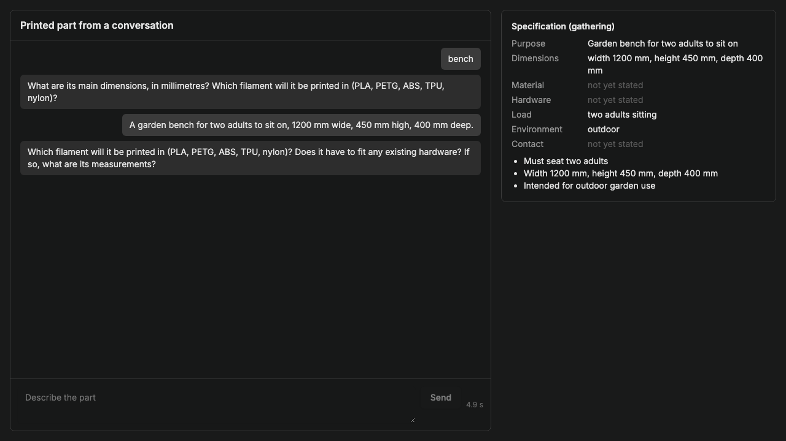
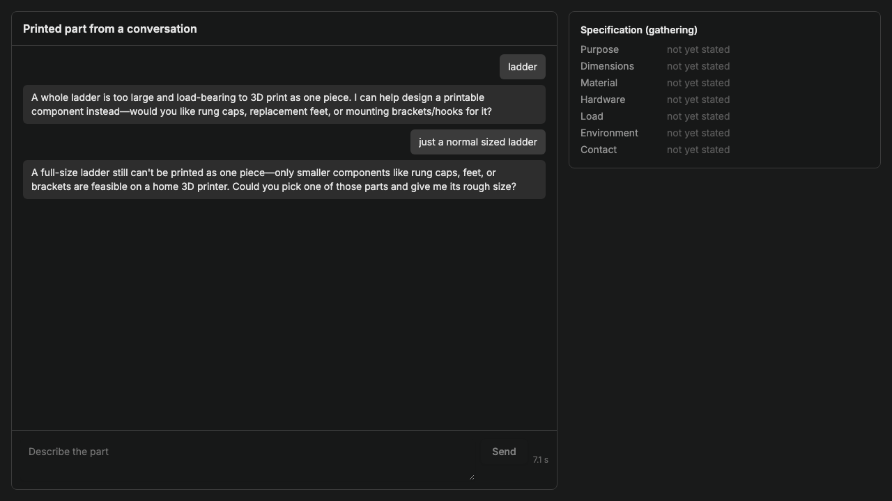
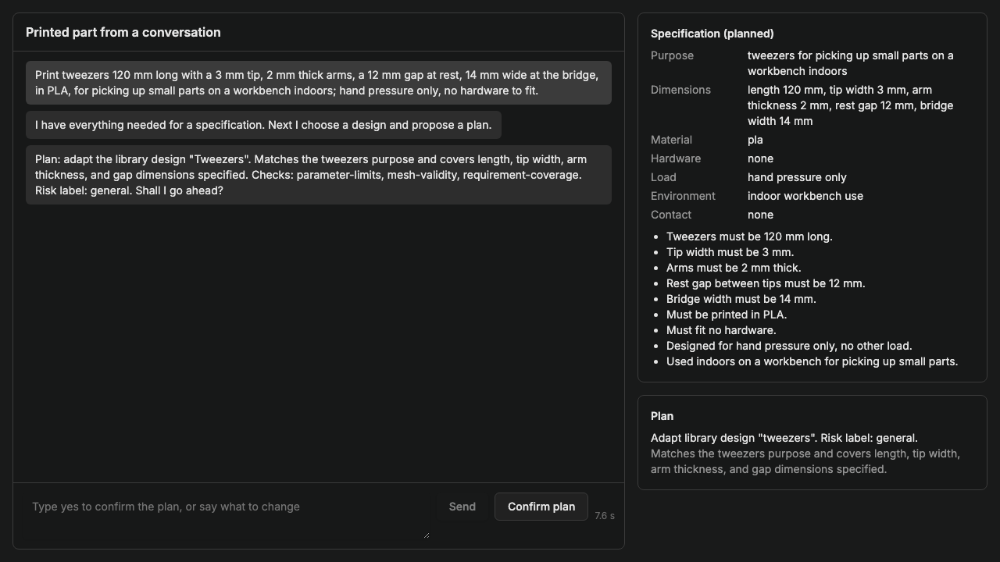
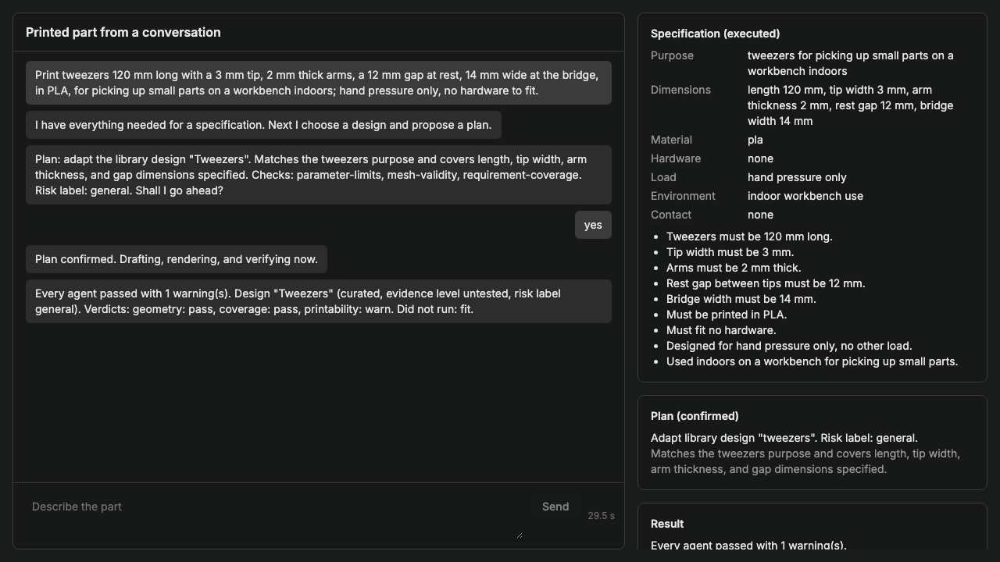
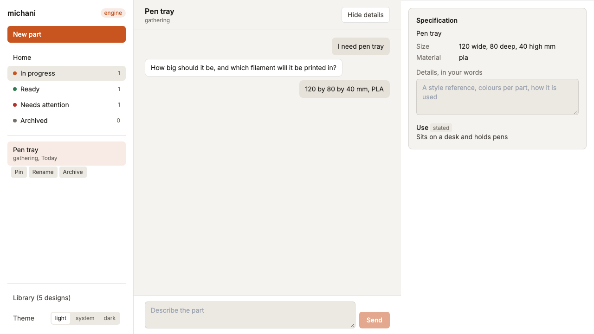

# Michani

Michani turns a conversation into a printable part. A person says what they need, answers questions about size and material, confirms a plan, and receives an STL mesh, the OpenSCAD source with its values set, and a report of every check that ran on it.

The programme exists for people who have a printer and no design file: field engineers on water and solar projects who need a bracket or fitting that matches hardware already on site, and people using a shared printer at a library, school, or makerspace who need a tool at filament cost.

## The flow

Each part is one session. The session moves through six states in order, and the state machine in `src/engine/session.ts` refuses any transition an agent has not earned.

### Workspace

Sessions are grouped by state. In progress, ready, and needs attention each list their parts, and the sidebar keeps the ones opened most recently.



### Gathering

The requirements agent reads the request and asks for what a specification still lacks. Size and material are the two questions that hold a session in this state. Purpose, hardware, load, environment, and contact fill in from whatever the person says.



Each answer updates the specification on the right, and the agent asks its next question.



When the request names something too large or too load-bearing to print, the agent says so and proposes printable components of it.



### Plan

With the specification complete, the engine chooses a library design or, when none matches, generation of new code. The plan states the design, the risk label, and the checks that will run. The person confirms it or says what to change. Nothing is drafted before that confirmation.



### Execution and result

Adaptation sets the declared parameters of a library design and writes no geometry. Generation writes new OpenSCAD from the specification. The renderer builds the mesh, and the verification agents judge it. A failed verdict goes back to drafting with its finding, up to three times.



### Reopening

A session keeps its transcript, specification, and result, and reopens from the sidebar in the state it reached.



## The library

Each design under `library/` is one OpenSCAD file and one JSON record. The record declares every adjustable value with a default, a minimum, and a maximum, and states the source, licence, attribution, part class, risk label, and evidence level. Evidence levels run from untested through prototyped and field used to test data published and clinically validated.

Adding a design means adding one folder. The current five are tweezers, a key turner, a pipe adapter, a panel mounting clip, and a two-part board enclosure. Shared components and material properties sit beside them in `library/components` and `library/materials.json`.

## Verification

Checks under `src/server/verification/checks` register against one interface. The current set covers parameter limits, mesh validity, printable size, requirement coverage, fit clearance, and hole alignment. Each returns pass, warn, fail, or did not run with its reason, and the report quotes the evidence.

The verification agents in `src/engine/agents/verification.ts` group those checks into geometry, coverage, printability, and fit verdicts. A part for medical, drinking-water, or load-bearing use carries the risk label "needs expert review" in its plan and report.

## Running it

Node.js 20.19 or 22.12 and newer, npm 10, Docker Desktop, the Supabase CLI, and an Anthropic API key. Every agent step calls Anthropic, so one key covers the application.

```bash
git clone https://github.com/reversely/michani.git
cd michani
npm install
uv sync                                 # pre-commit tooling
supabase start -x logflare,vector       # local database and auth
cp .env.local.template .env.local       # Supabase URL and keys from `supabase status`, plus ANTHROPIC_API_KEY
npm run dev                             # http://localhost:3000/cadam/engine
```

The other provider keys in the template stay as placeholders.

## Tests

```bash
npm run typecheck && npm run lint && npm run test:unit     # fast suite, recorded model answers
npm run test:e2e                                           # Playwright, needs Supabase and the dev server
LIVE_AGENT_TESTS=1 npm run test:unit -- agents             # calls Anthropic
```

The pre-commit hook runs file hygiene, the type check, and lint-staged.

## Layout

| Path                       | Contents                                                                         |
| -------------------------- | -------------------------------------------------------------------------------- |
| `src/engine`               | Session state machine, loop, requirements and verification agents, tool registry |
| `src/server/agents`        | Library, drafting, and generation prompts and output schemas                     |
| `src/server/verification`  | Check registry and the checks                                                    |
| `src/server/report`        | Check report and package builder                                                 |
| `src/views/EngineView.tsx` | The workspace and conversation screen                                            |
| `library/`                 | Designs and their metadata records                                               |
| `tests/`                   | Unit, render, and end-to-end suites with recorded fixtures                       |
| `supabase/`                | Migrations and local stack configuration                                         |

## CAD

OpenSCAD is the only CAD language. Library files declare their adjustable values as top-level variables with Customizer range comments, and the drafting agent passes values as variable overrides without touching the file body. Rendering runs in the browser through an OpenSCAD WebAssembly build with the BOSL, BOSL2, MCAD, and NopSCADlib libraries, and the editor exports STL, SCAD, and DXF.

That renderer, the parameter sliders, the export path, and the Supabase-backed application shell come from [CADAM](https://github.com/Adam-CAD/CADAM) by AdamCAD, which this repository forks. Michani is distributed under the GNU General Public License v3.0 (see `LICENSE`), the same licence as CADAM and the portions of openscad-web-gui it derives from. The bundled OpenSCAD WASM binaries are GPL v2 or later, distributed here under GPLv3 as part of the combined work; see `src/vendor/openscad-wasm/SOURCE-OFFER.txt`. Each library design carries its own licence and attribution in its metadata record, and the package copies them into the download.
